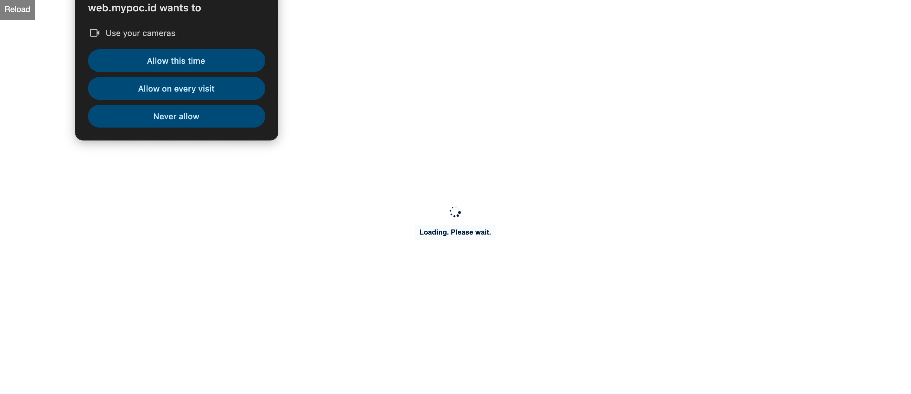
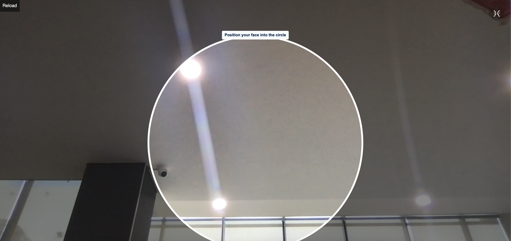
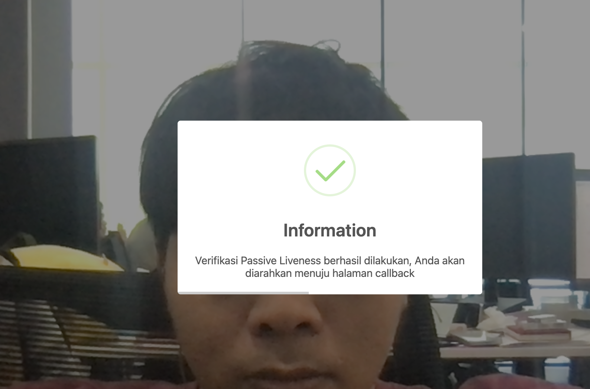

# ASLIRI LIVENESS WEB
Liveness Web by ASLIRI for your web apps. You can verification your client with our product.

## Get Started
Before integrating ASLIRI Liveness Web, you need to have an authorization for credentials. Please contact [ASLIRI](https://asliri.id) to get credentials. You will get:
1. **api-create-session**
2. **verification-url**
3. **token-sdk**

## How does the ASLIRI Liveness Web process work?

### VERIFICATION

1. Hit the **api-create-session** API with header **token-sdk**.
2. Our side will give you the **req_id**.
3. Your side can redirect to the **verification-url** with **req_id**, **app_session**, & **callback**  (callback with UriEncoded) parameter.
4. The verification process runs.
5. If process done, our side will redirect to the **callback** url you sent earlier and add the parameter
-  **verify_status** (true/false)
- **message**
- **req_id**
- **photo_passive_url** (for Passive Liveness)
- **photo_neutral_url** (for Smile Liveness)
- **photo_smile_url** (for Smile Liveness)


## How do I integrate ASLIRI Liveness Web ?

### VERIFICATION
#### 1. Hit the API Create Session

URL : **{api-create-session}**
Method: POST JSON

Sample Header Request:
```
Content-Type: "application/json" // json request
token-sdk: "1Z234567A" // token-sdk
```

Sample JSON Body Request:
```json
{
	"app_id": "APP001",
	"callback_url": "http%3A%2F%2Flocalhost%3A3000", //uriencoded
	"app_session": "SESSION002"
}
```

Sample Response:
```json
{
    "code": 200, // status code
    "message": "success", // message
    "result": { // result reqid
        "req_id": "hyjxPh5RXuds5Y4F3FMQ%2FBDYFnF8%2F4qvhlog6MzhAnCR%2BA6Uhkqwv17feZm7FCkWYaCQOc1NDhBI42oA95%2BiEc%2FT8aglujzX4%2BDJWAlqe4%2BUMIm275WITfJEeKTKUdn26ubLf0ePUrsu3Jg5"
    }
}
```

*Please note: only code **200** is success*

#### 2. Redirect to Verification URL
Your side need redirect to verification url.

Sample redirect:
http://verification-url.id?req_id=hyjxPh5RXuds5Y4F3FMQ%2FBDYFnF8%2F4qvhlog6MzhAnCR%2BA6Uhkqwv17feZm7FCkWYaCQOc1NDhBI42oA95%2BiEc%2FT8aglujzX4%2BDJWAlqe4%2BUMIm275WITfJEeKTKUdn26ubLf0ePUrsu3Jg5&callback=http%3A%2F%2Flocalhost%3A3000&app_session=SESSION002

*Please note: the **callback** must be **UrlEncoded** as example*

#### 3. Verification Process runs


*Image: allow camera*



*Image: verification liveness*



*Image: success verification and will be redirect to **callback** .*

Sample redirect:
Passive Liveness
http://localhost:3000?verify_status=true&message=success=req_id=xxxxxx&photo_passive_url=https%3A%2F%2Fdev-asliri.id%3A9000%2Fpassive-liveness-web-dev%2F2cded782-xx.jpg

Smile Liveness:
http://localhost:3000?verify_status=false&message=success=req_id=xxxxxx&photo_neutral_url=https%3A%2F%2Fdev-asliri.id%3A9000%2Fsmile-liveness-web-dev%2F2cded782-xx.jpg&photo_smile_url=https%3A%2F%2Fdev-asliri.id%3A9000%2Fsmile-liveness-web-dev%2F2cded782-xx.jpg


Done.

